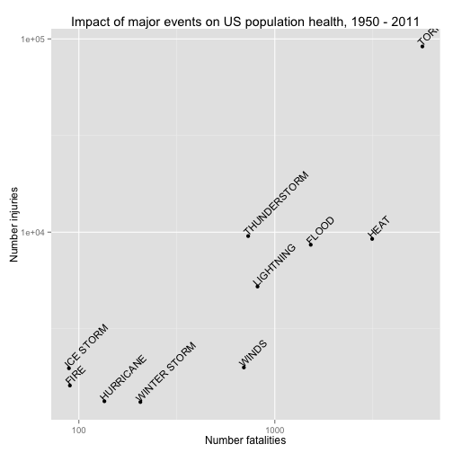
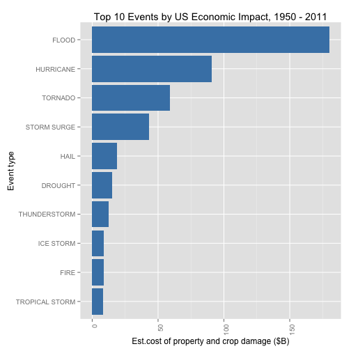

# Analysis of the impact of severe weather events with respect to population health and the economy in the United States from 1950 to 2011.

## 24 May 2014

## Synopsis

This research set out to answer:

1. Which types of severe weather events are most harmful with respect to population health in the United States?

1. Which types of severe weather events have the greatest economic consequences in the US.

The research used Storm Data from the National Weather Service, which records severe weather events from 1950 to 2011.

Data on fatality and injury was used as a measure of impact to population health, and the cost of property and crop damage has been used as a measure of economic impact.

The research found that while severe weather events such as Tornados, Lightning, and Flash Floods were well represented in the [list of top causes](#top10health), also significant were events that occurred over a period of time such as heat waves.

Top causes of fatality and injury and damage to the economy shared similar events. Tornados topped both lists by a significant margin. Heat waves in particular are a significant cause of death and injury, whereas water-related events such as flood and drought have a prominant impact to property and crops.

The [Results](#results) section lists the top event types impacting both population health and the economy.

## Data Processing

The data for this study is from  the U.S. National Oceanic and Atmospheric Administration's (NOAA) storm database. This database tracks characteristics of major storms and weather events in the United States, including when and where they occur, as well as estimates of any fatalities, injuries, and property damage.

The following R packages are used in this analysis.


```r
library(plyr)
library(ggplot2)
```


The raw data is downloaded from the NOAA website as a compressed CSV file: "repdata-data-StormData.csv.bz2". The following code reads the file. (The compressed file format is automatically unzipped.)


```r
storm.data <- read.csv("data//repdata-data-StormData.csv.bz2", header = T, nrows = 902298, 
    stringsAsFactors = F)
```


The file contains 902,297 observations of 37 variables.

In particular, the following data has been used:
* Number of fatalities (FATALITIES) and injuries (INJURIES) for each type of event (EVTYPE).
* Estimated cost of damage to property (PROPDMG) and crops (CROPDMG) for each type of event.
* LATITUDE and LONGITUDE of events. (This is not available for all event types, such as heat waves and floods, which occur over a larger area of land.)

Event types included instances similar in meaning for the purposes of this analysis, and duplicates as a result of variation in spelling. For example, TORNADO is represented by TORNADOS, TORNADO F1, WATERSPOUT/TORNADOS, TORNDAO, etc. Significant categories of event types have been grouped together with the following code.


```r
storm.data[grepl("torn", storm.data$EVTYPE, ignore.case = T), ]$EVTYPE <- "TORNADO"
storm.data[grepl("flood", storm.data$EVTYPE, ignore.case = T), ]$EVTYPE <- "FLOOD"
storm.data[grepl("hurricane", storm.data$EVTYPE, ignore.case = T), ]$EVTYPE <- "HURRICANE"
storm.data[grepl("(tstm|t\\w+orm|typhoon)", storm.data$EVTYPE, ignore.case = T), 
    ]$EVTYPE <- "THUNDERSTORM"
storm.data[grepl("wind", storm.data$EVTYPE, ignore.case = T), ]$EVTYPE <- "WINDS"
storm.data[grepl("heat", storm.data$EVTYPE, ignore.case = T), ]$EVTYPE <- "HEAT"
storm.data[grepl("fire", storm.data$EVTYPE, ignore.case = T), ]$EVTYPE <- "FIRE"
storm.data[grepl("frost", storm.data$EVTYPE, ignore.case = T), ]$EVTYPE <- "FROST"
storm.data$EVTYPE <- as.factor(storm.data$EVTYPE)
```


Key metrics are summarized by event type.


```r
summary.fatalities <- ddply(storm.data, .(EVTYPE), summarize, total.fatalities = sum(FATALITIES))
summary.fatalities <- subset(summary.fatalities, total.fatalities > 0)
by.fatalities <- arrange(summary.fatalities, desc(total.fatalities))

summary.injuries <- ddply(storm.data, .(EVTYPE), summarize, total.injuries = sum(INJURIES))
summary.injuries <- subset(summary.injuries, total.injuries > 0)
by.injuries <- arrange(summary.injuries, desc(total.injuries))

summary.total <- ddply(storm.data, .(EVTYPE), summarize, total.fatalities = sum(FATALITIES), 
    total.injuries = sum(INJURIES))
summary.total$total <- summary.total$total.fatalities + summary.total$total.injuries
summary.total <- subset(summary.total, total > 0)
by.total <- arrange(summary.total, desc(total))
```


Estimated costs for property and crop damage are each stored in two columns. The first is the amount, and the second is the unit such as "K" for thousands of dollars, "M" for millions, etc. If the unit column is empty or contains an unknown value, then a unit of 1 has been assumed. The following code normalizes the costs.


```r
m <- c(H = 100, K = 1000, M = 1e+06, B = 1e+09, N = 1)
damage <- storm.data
ind <- match(toupper(as.character(damage$PROPDMGEXP)), names(m), nomatch = 5)
damage$property.cost <- damage$PROPDMG * m[ind]
ind <- match(toupper(as.character(damage$CROPDMGEXP)), names(m), nomatch = 5)
damage$crop.cost <- damage$CROPDMG * m[ind]
damage <- subset(damage, property.cost > 0 | crop.cost > 0)
damage.summary <- ddply(damage, .(EVTYPE), summarize, total.property = round(sum(property.cost)/1e+09, 
    2), total.crop = round(sum(crop.cost)/1e+09, 2))
damage.summary$total.cost <- damage.summary$total.property + damage.summary$total.crop
by.total.cost <- arrange(damage.summary, desc(total.cost))
```


<a name="results"></a>
## Results

### Population health impact

The top 10 event types if we combine fatality and injury figures are:


```r
top10 <- by.total[1:10, ]
ggplot(top10, aes(reorder(EVTYPE, total), total)) + xlab("Event type") + ylab("Number fatalities/injuries") + 
    theme(axis.text.x = element_text(angle = 90, hjust = 1)) + coord_flip() + 
    geom_bar(stat = "identity")
```

 


|EVTYPE        |  total.fatalities|  total.injuries|  total|
|:-------------|-----------------:|---------------:|------:|
|TORNADO       |              5661|           91407|  97068|
|HEAT          |              3138|            9224|  12362|
|THUNDERSTORM  |               731|            9549|  10280|
|FLOOD         |              1525|            8604|  10129|
|LIGHTNING     |               816|            5230|   6046|
|WINDS         |               695|            1994|   2689|
|ICE STORM     |                89|            1975|   2064|
|FIRE          |                90|            1608|   1698|
|WINTER STORM  |               206|            1321|   1527|
|HURRICANE     |               135|            1328|   1463|


<a name="top10health"></a>
Furthermore, if we weight the harm to population health of a fatality, say by a factor of 10, then the top 10 event types are:


```
##          EVTYPE total.fatalities total.injuries total total.weighted
## 1       TORNADO             5661          91407 97068         148017
## 2          HEAT             3138           9224 12362          40604
## 3         FLOOD             1525           8604 10129          23854
## 4  THUNDERSTORM              731           9549 10280          16859
## 5     LIGHTNING              816           5230  6046          13390
## 6         WINDS              695           1994  2689           8944
## 7   RIP CURRENT              368            232   600           3912
## 8  WINTER STORM              206           1321  1527           3381
## 9     ICE STORM               89           1975  2064           2865
## 10    HURRICANE              135           1328  1463           2678
```


Severe events such as tornados cause a great deal of damage over a short period of time and are very localized. Whereas events such as strong wind cause more frequent damage across a larger segment of the population.


```r
health <- storm.data
health$total <- health$FATALITIES + health$INJURIES
health$harm.bracket <- cut(health$total, breaks = 10)
us.boundary <- subset(health, LATITUDE < 4924 & LATITUDE > 2431 & LONGITUDE > 
    6657 & LONGITUDE < 12446)
us.boundary$date <- strptime(as.character(us.boundary$BGN_DATE), "%m/%d/%Y %H:%M:%S")
us.2011 <- us.boundary[format(us.boundary$date, "%Y") == "2011", ]

# include top 12 across all years in intersection as some top ranked event
# types do not have geo data points
us.top.6 <- us.2011[us.2011$EVTYPE %in% by.total$EVTYPE[1:12], ]

ggplot(us.top.6, aes(LONGITUDE, LATITUDE, alpha = harm.bracket, size = harm.bracket)) + 
    scale_x_reverse() + facet_wrap(~EVTYPE, nrow = 3, ncol = 2) + geom_point(color = "red")
```

 


* This plot does not include non-localized events such as heat waves.

The top 10 event types by fatality are:

|EVTYPE        |  total.fatalities|
|:-------------|-----------------:|
|TORNADO       |              5661|
|HEAT          |              3138|
|FLOOD         |              1525|
|LIGHTNING     |               816|
|THUNDERSTORM  |               731|
|WINDS         |               695|
|RIP CURRENT   |               368|
|AVALANCHE     |               224|
|WINTER STORM  |               206|
|RIP CURRENTS  |               204|


The top 10 event types by injury are:

|EVTYPE        |  total.injuries|
|:-------------|---------------:|
|TORNADO       |           91407|
|THUNDERSTORM  |            9549|
|HEAT          |            9224|
|FLOOD         |            8604|
|LIGHTNING     |            5230|
|WINDS         |            1994|
|ICE STORM     |            1975|
|FIRE          |            1608|
|HAIL          |            1361|
|HURRICANE     |            1328|


### Economic impact

The top 10 event types wrt total economic cost are:


```r
top10 <- by.total.cost[1:10, ]
ggplot(top10, aes(reorder(EVTYPE, total.cost), total.cost)) + xlab("Event type") + 
    ylab("Est.cost of property and crop damage ($B)") + ggtitle("Top 10 Events by Economic Impact, 1950 - 2011") + 
    theme(axis.text.x = element_text(angle = 90, hjust = 1)) + coord_flip() + 
    geom_bar(stat = "identity")
```

 


|EVTYPE          |  total.property|  total.crop|  total.cost|
|:---------------|---------------:|-----------:|-----------:|
|FLOOD           |          167.53|       12.38|      179.91|
|HURRICANE       |           84.76|        5.52|       90.28|
|TORNADO         |           58.59|        0.42|       59.01|
|STORM SURGE     |           43.32|        0.00|       43.32|
|HAIL            |           15.73|        3.03|       18.76|
|DROUGHT         |            1.05|       13.97|       15.02|
|THUNDERSTORM    |           11.58|        1.27|       12.85|
|ICE STORM       |            3.94|        5.02|        8.96|
|FIRE            |            8.50|        0.40|        8.90|
|TROPICAL STORM  |            7.70|        0.68|        8.38|


The plot below 


```r
us.boundary <- subset(damage, LATITUDE < 4924 & LATITUDE > 2431 & LONGITUDE > 
    6657 & LONGITUDE < 12446 & property.cost > 1e+05)
us.boundary$cost.bracket <- cut(us.boundary$property.cost, breaks = 10)
us.boundary$date <- strptime(as.character(us.boundary$BGN_DATE), "%m/%d/%Y %H:%M:%S")
us.top.6 <- us.boundary[us.boundary$EVTYPE %in% by.total$EVTYPE[1:6], ]
ggplot(us.top.6, aes(LONGITUDE, LATITUDE, alpha = cost.bracket, size = cost.bracket)) + 
    scale_x_reverse() + facet_wrap(~EVTYPE, nrow = 2, ncol = 2) + geom_point(color = "steelblue")
```

```
## Error: nrow * ncol >= n is not TRUE
```


* This plot does not include non-localized events such as droughts.
